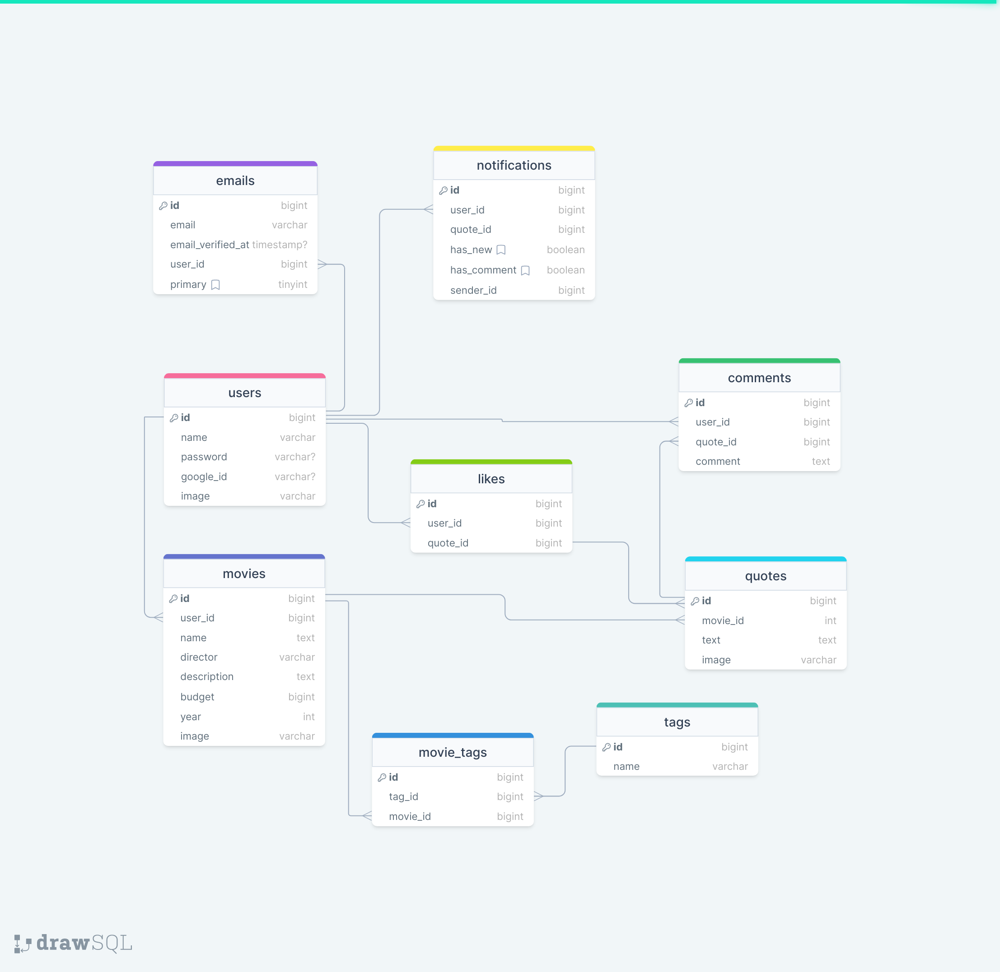

# Epic Movie Quotes

In Epic Movie Quotes App you can find quotes of movies.

##

## Table of Contents

-   [Prerequisites](#prerequisites)
-   [Tech Stack](#tech-stack)
-   [Getting Started](#getting-started)
-   [Migrations](#migration)
-   [Development](#development)
-   [Mysql Diagram](#mysql-diagram)
-   [Resources](#resources)

##

## Prerequisites

-   PHP@8.0.2
-   MYSQL@8
-   npm@8
-   composer@2.4.3

##

## Tech Stack

-   [Laravel@9.x](https://laravel.com/docs/9.x/releases) - back-end framework
-   [Spatie Translatable](https://spatie.be/docs/laravel-translatable/v6/introduction) - package for translation

##

## Getting Started

1. First of all you need to clone Epic Movie Quotes repository from github:

```bash
 git clone https://github.com/RedberryInternship/temo-jincharadze-epic-movie-quotes-back.git
```

2. Next step requires you to run composer install in order to install all the dependencies:

```bash
 composer install
```

3. After you have installed all the PHP dependencies, it's time to install all the JS dependencies:

```bash
 npm install
```

4. Now we need to set our env file. Go to the root of your project and execute this command.

```bash
cp .env.example .env
```

5. Now you should provide .env file all the necessary environment variables:

```bash
APP_URL=*******

FRONT_URL=*******


DB_CONNECTION=mysql
DB_HOST=127.0.0.1
DB_PORT=3306
DB_DATABASE=*******
DB_USERNAME=*******
DB_PASSWORD=*******

BROADCAST_DRIVER=log
SESSION_LIFETIME=120
SESSION_DOMAIN=localhost
SESSION_DRIVER=file
QUEUE_CONNECTION=sync
FILESYSTEM_DISK=public
SANCTUM_STATEFUL_DOMAINS=localhost:3000/

PUSHER_APP_KEY=*******
PUSHER_APP_SECRET=*******
PUSHER_APP_ID=*******
PUSHER_APP_CLUSTER=*******


MAIL_MAILER=smtp
MAIL_HOST=smtp.googlemail.com
MAIL_PORT=587
MAIL_USERNAME=*******
MAIL_PASSWORD=*******
MAIL_ENCRYPTION=tls
MAIL_FROM_NAME="Movie Quotes"

GOOGLE_CLIENT_ID=*******
GOOGLE_CLIENT_SECRET=*******
GOOGLE_REDIRECT=*******
```

##

## Migration

if you've completed getting started section, then just execute:

```bash
php artisan migrate
php artisan db:seed
```

##

## Development

You can run Laravel's built-in development server by executing:

```bash
php artisan serve
```

##

## Mysql Diagram

[View Diagram](https://drawsql.app/teams/redberry-33/diagrams/epic-movies)


## Resources

-   [Figma design](https://www.figma.com/file/5uMXCg3itJwpzh9cVIK3hA/Movie-Quotes-Bootcamp-assignment?node-id=5134%3A33290&t=g8Re9fGoWibBsQsL-0) - Figma is a collaborative web application for interface design, with additional offline features enabled by desktop applications for macOS and Windows.
-   [Semantic commits](https://redberry.gitbook.io/resources/other/git-is-semantikuri-komitebi) - Git commits were done with the following information provided in this article.
-   [Assignment](https://redberry.gitbook.io/assignment-iv-movie-quotes-1/) This assignment was done with the following requirements provided in this assignment description.
